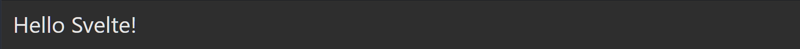
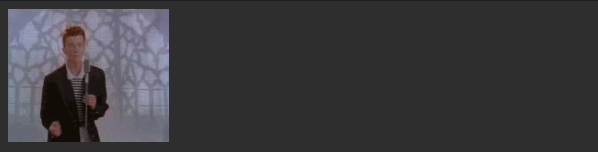
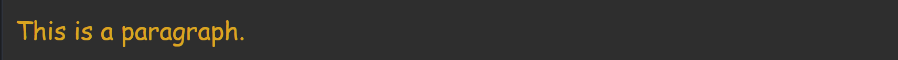
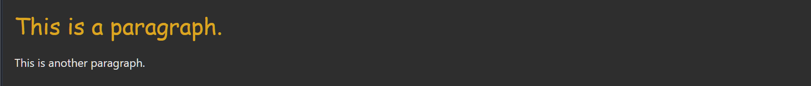

类似于React，Svelte也使用“{}”包含内嵌脚本代码：  

#### 1.在HTML中插入变量：

```
<script lang="ts">
    let name = 'Svelte';
</script>
<h1>Hello {name}!</h1>
```

Output:


#### 2.在HTML中插入图片：

```
<script>
 let src = '/tutorial/image.gif';
    let name = 'Svelte'
</script>

```

Output:



对于Svelte来说，每一个.svelte都是一个组件，你可以在任何一个组件中添加\<style\>\<\/style\>标签来自定义样式，该样式的作用域仅在组件内部：

```
<p>This is a paragraph.</p>
<style>
	/* Write your CSS here */
	p {
		color: goldenrod;
		font-family: 'Comic Sans MS', cursive;
		font-size: 2em;
	}
</style>
```

Output:



你可以使用import导入其他组件，但是被导入的组件的样式不会受到组件内的style样式影响：

```
App.svelte

<script lang="ts>
    import Nested from './Nested.svelte';
</script>
<p>This is a paragraph.</p>
<style>
	p {
		color: goldenrod;
		font-family: 'Comic Sans MS', cursive;
		font-size: 2em;
	}
</style>
<Nested />
```

```
Nested.svelte

<p>This is another paragraph.</p>
```
Output:



